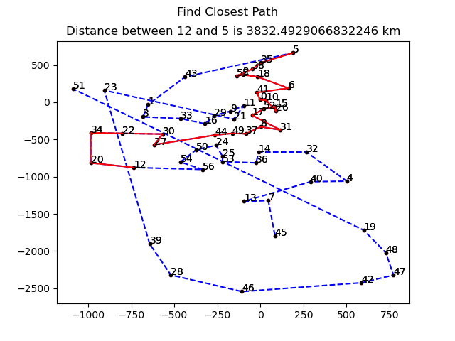

## TRAVELING SALESMAN PROBLEM
###Usage
```python
from TSM import greedy,smallest_increase,read_all,find_closest_path
nodes = read_all('resources/sehir_xy')
start_idx = 0
end_idx = 6
smallest_book, distance_result = smallest_increase(nodes, start_idx, end_idx, plot=True, plot_annotate=True)
greedy_book, distance_result = greedy(nodes, start_idx, end_idx, plot=False)
find_closest_path(greedy_book, 12, 5, plot=True)
# find_closest_path(smallest_book, 12, 5, plot=True, show_route=True, suptitle='Smallest Increase Algorithm Route')
```
### Find Closest Path
```python
from TSM import greedy,smallest_increase,read_all,find_closest_path
greedy_book, distance_result = greedy(nodes, start_idx, end_idx, plot=False)
find_closest_path(greedy_book, 12, 5, plot=True)
```
### Result


### Find Closest Path
```python
from TSM import greedy,smallest_increase,read_all,find_closest_path
greedy_book, distance_result = greedy(nodes, start_idx, end_idx, plot=False)
find_closest_path(greedy_book, 12, 5, plot=True)
```
### Result
